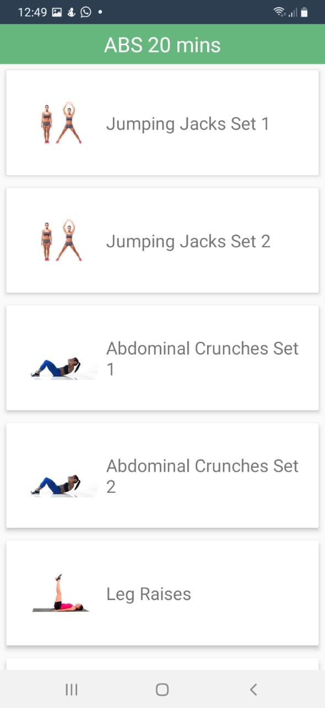

## FitNEss
Physical fitness and mental health monitoring app

This app provides the users with useful tools and facilities to aid in the enhancement of their nutritional habits, physical health and mental well being.
All the facilities are provided in a way that is not only easy to use and navigate but also efficient and user friendly.

FitNEss aims to aid the user with the combination of good nutrition, right physical and mental practices and appropriate thoughts.
The following are the tools and facilities provided to the user:
### 1) Nutrition and Calorie Tracker and Recorder

  
  

### 2) Workout Regimes for Physical Fitness

### 3) Step Counter

### 4) Yoga Practices for Physical and Mental Well Being

### 5) Meditation Practices for Good Mental Health

### 6) Positive Thought Practices for Maintenance of Mental Balance

### 7) Inspirational Video for the day

